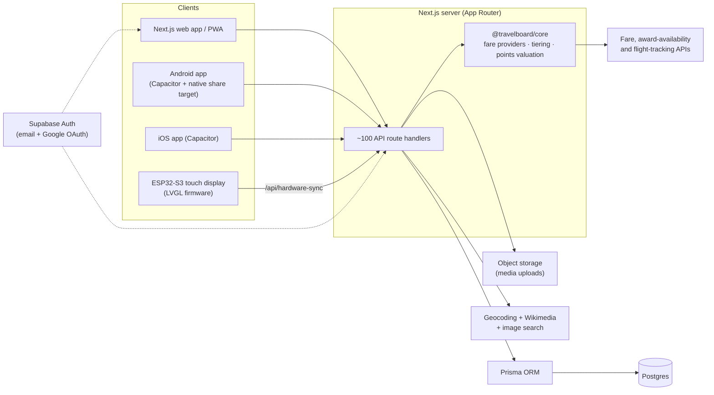

# TravelBoard

**A map-first travel journal and flight-deals board.** Countries glow with the places you want to go, a "passport" layer lights up where you have been, and a fare engine finds cheap flights and award seats from your home airport.

> **Status: archived prototype.** TravelBoard was an early version of the travel app that later became **TrekMap**. Active development moved to a new repository. This repo is kept as a reference for the architecture and the deal engine that grew out of it.

---

## Highlights

- **Interactive world map** built on MapLibre GL: a choropleth "wish glow" by country, flag-colored borders, a separate teal "been there" layer, and US-state granularity.
- **Travel journal**: pins carry notes, photos, links, seasons, reminders and per-place fare thresholds.
- **Flight-deals engine** (`packages/core`): fans one query out to several fare sources in parallel, de-duplicates to one best offer per destination, then tiers, scores and filters the results for realistic trips.
- **Points and awards**: card-to-program-to-airline transfer paths, cents-per-point valuation, and award-seat "deals" anchored to your home airport or nearest hub.
- **Social layer**: private-by-default boards, friends and read-only friend boards, plus a public feed where individual spots can be published.
- **Beyond the browser**: installable PWA with offline fallback, Capacitor Android/iOS shells with a native share target, and ESP32 firmware for a 7" wall display.

## Features

### Journal and map
| Feature | What it does |
| --- | --- |
| Wish glow | Countries are shaded by how many wishes they hold. Two themes: classic amber or per-country flag colors. |
| Passport | Mark visited countries and US states from the map or a searchable checklist. Stored separately from wishes, so it never skews the glow. |
| Country panel | Clicking a country opens its places. Several places show as compact cards you can drag to reorder; one place shows a full card. |
| Add places | Search OpenStreetMap, drop a pin, right-click a country, or share a link from your phone. Shared Instagram/TikTok links open a prefilled form. |
| Cover photos | Wikimedia plus an optional image-search API. Results are cached in Postgres with fuzzy and cross-language reuse, then re-served through an SSRF-guarded image proxy. |
| Duplicate guard | Warns before saving a wish that matches an existing one, even across languages (for example *salar* and *salt flat*). |
| Draft inbox | A keyed ingest endpoint collects links as drafts and auto-enriches them from captions, locations and cover images. |

### Deals, points and tools
| Area | What it does |
| --- | --- |
| Explore / Search | Map-based deal discovery with price-labeled airport dots and flight arcs, plus search with calendar and trend views. |
| Fare model | Affordability tiers (cheap / fair / splurge), distance-banded trip lengths (short-haul 3-7 nights up to ultra-long-haul 10-21), and a layover and day-trip feasibility estimator that labels its own uncertainty. |
| Alerts and watches | Watch a route and get alerted when fares drop below your threshold. |
| Points tools | Points calculator, transfer optimizer, card manager and loyalty tracker. |
| Trip tools | Trip planner with multi-leg plans, fare prediction, flight tracker, memory map, savings dashboard and packing list. |
| Community | Shared deal boards with votes and comments, activity feed and gamification badges. |

## Architecture



**Design choices**

- **Provider boundary.** Every fare source implements one `FlightProvider` interface. An aggregate provider fans out with `Promise.allSettled`, keeps the best sane price per destination and records which sources quoted it. Composable retry (exponential backoff) and circuit-breaker wrappers are provided for any source.
- **Cache first.** Fares, searches, award availability and image lookups are cached in Postgres, so the UI reads from cache instead of paying per request.
- **Honest numbers.** Award costs, layovers and trip feasibility are estimates, and they are labeled as estimates in the data model and the UI.
- **Access control in one place.** Board visibility (owner or accepted friend) and public-feed exposure are enforced server-side. Only safe fields ever reach the public feed.

## Tech stack

| Layer | Technology |
| --- | --- |
| Web | Next.js 16 (App Router), React 19, TypeScript, Tailwind CSS 4 |
| Map | MapLibre GL JS over a free CARTO dark basemap (no map API token) with GeoJSON country and US-state boundaries |
| Data | PostgreSQL (Supabase) with Prisma 6, 30 models, versioned migrations |
| Auth | Supabase Auth (email/password and Google OAuth) via `@supabase/ssr` session cookies |
| Media | `sharp` for resizing and decluttering, local disk in dev or Supabase Storage in prod |
| Shared logic | `@travelboard/core`, a TypeScript package for providers, fare tiering, geo math and points valuation |
| Mobile | Capacitor 8 (Android and iOS) plus a Kotlin share-target activity |
| Hardware | ESP32-S3 (Waveshare 7" 1024x600 touch LCD), PlatformIO, LVGL 8 |
| Testing | Vitest (app integration tests and core unit tests) |
| Hosting | Vercel (earlier builds ran as a static export on Cloudflare Pages) |

## Repository layout

```
src/
  app/            Next.js routes, pages and ~100 API route handlers under app/api
  components/     React UI: map, side panels, journal, deals, tools, settings
  lib/            auth, access control, storage, geocoding, image search/proxy, similarity
packages/core/    @travelboard/core: fare providers, aggregation, tiering, points, geo
prisma/           schema, migrations and seed scripts
android/          Capacitor Android shell + native share target
ios/              Capacitor iOS shell
esp32-touch/      PlatformIO firmware for the ESP32-S3 touch display
scripts/          backups, cache warming, deploy helpers, dev tooling
__tests__/        API and fare-engine integration tests
public/           static assets, GeoJSON, PWA manifest and service worker
```

## Getting started

Requires Node 20 and a PostgreSQL database (a free Supabase project works).

```bash
npm install                 # also runs `prisma generate`
cp .env.example .env        # fill in the variables below
npx prisma migrate deploy   # apply migrations
npm run dev                 # http://localhost:3000
```

Without any fare-provider keys the app still runs, falling back to mock data.

### Environment variables

Set these in `.env`. Never commit real values.

| Variable | Required | Purpose |
| --- | --- | --- |
| `DATABASE_URL`, `DIRECT_URL` | yes | Postgres connection strings (pooled runtime and direct for migrations) |
| `NEXT_PUBLIC_SUPABASE_URL`, `NEXT_PUBLIC_SUPABASE_ANON_KEY` | yes | Supabase Auth (public client values) |
| `SUPABASE_URL`, `SUPABASE_SERVICE_ROLE_KEY`, `SUPABASE_STORAGE_BUCKET` | prod | Media storage. The service-role key is server-only. |
| `STORAGE_DRIVER` | no | `local` (default) or `supabase` |
| `FLIGHT_PROVIDER`, `TEQUILA_API_KEY`, `TRAVELPAYOUTS_TOKEN`, `SEATSAERO_API_KEY`, `AIRLABS_API_KEY` | no | Fare, award and flight-tracking providers. Mock data is used when unset. |
| `FLIGHT_API_KEY` | no | API key required to `POST /api/flight-prices` |
| `SERPER_API_KEY`, `GOOGLE_CSE_API_KEY`, `GOOGLE_CSE_CX` | no | Image search for cover photos. Placeholders are used when unset. |
| `WHATSAPP_INGEST_KEY`, `WHATSAPP_OWNER_USERNAME` | no | Shared secret and owner account for the draft-ingest endpoint, share target and cache-warm job |

### Scripts

| Command | Purpose |
| --- | --- |
| `npm run dev` | Dev server on port 3000 |
| `npm run build` / `npm start` | Production build and server |
| `npm test` | Vitest suite |
| `npm run db:seed` | Load demo data, but only into an empty account |
| `npm run cap:build:android` / `cap:build:ios` | Build the Capacitor mobile shells |
| `npm run esp32:upload` | Flash the ESP32 display firmware (PlatformIO) |

### Data safety

Your places live in Postgres, not in the repo. Avoid `npx prisma migrate reset` and `TRAVELBOARD_SEED_RESET=1 npx prisma db seed` unless you intend to wipe data. For a version-independent logical backup and restore:

```bash
node scripts/export-db-backup.mjs                       # writes backups/travelboard-data-<timestamp>.json
node scripts/import-db-backup.mjs backups/<file>.json   # restore into a migrated, empty database
```

## API overview

| Group | Routes | Notes |
| --- | --- | --- |
| Auth and users | `/api/auth/*`, `/api/users`, `/api/profile`, `/api/onboarding` | Supabase sessions. Log in with email or username. |
| Journal | `/api/locations`, `/api/journal`, `/api/drafts`, `/api/upload` | CRUD, starring, reordering, draft enrichment |
| Social | `/api/friends`, `/api/boards`, `/api/public/feed`, `/api/notifications` | Private boards, friend access, public spots |
| Deals | `/api/deals`, `/api/fares`, `/api/search`, `/api/awards`, `/api/fare-prediction` | Cached, aggregated fare data |
| Points | `/api/points`, `/api/loyalty` | Valuation, transfer optimization, balances |
| Planning | `/api/trips`, `/api/watches`, `/api/alerts`, `/api/track`, `/api/lounges`, `/api/packing` | Trip plans, fare watches, flight status |
| Media and geo | `/api/geocode`, `/api/cover-image`, `/api/fetch-previews`, `/api/cover-proxy`, `/api/image-proxy` | Geocoding, cover search, safe image proxying |
| Devices | `/api/hardware-sync`, `/api/hardware-cover` | Compact JSON and images for the ESP32 display |

## Companion clients

- **Android / iOS**: Capacitor shells around the web app. On Android, a native share target sends any link (for example an Instagram reel) straight into a prefilled "Add a place" form. See [`android/README.md`](android/README.md).
- **ESP32 wall display**: firmware for a Waveshare ESP32-S3 7" touch LCD that renders the wishlist and a world pin map, syncing over Wi-Fi or a USB serial bridge. See [`esp32-touch/README.md`](esp32-touch/README.md).

## Project history

TravelBoard began as a personal travel bucket-list map. It was then merged with the flight-deals engine from an earlier prototype, which brought in the shared `@travelboard/core` package, and later moved from Clerk to Supabase Auth and from local Postgres to Supabase. The project continued as **TrekMap**, which carries these ideas forward in a new codebase.
